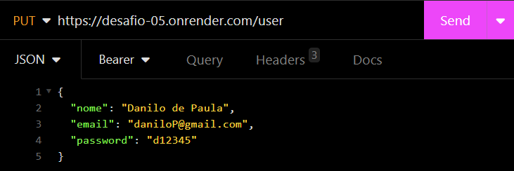
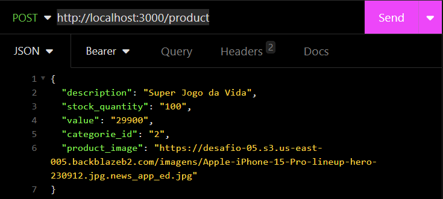

# PDV-System
#### A API foi desenvolvida baseada em um PDV (Frente de caixa), isso é um projeto piloto, no futuro será implementado outras funcionalidades.
#
**COMO USAR**
<details>
<summary><b>Como Funciona as Rotas</b></summary>

**Para o código funcionar você precisa adicionar uma senha entre '' da sua escolha no `.env`**


1. Route **`GET` "listCategories"** - _Bearer Token required_

   - Add domain and API path:
     ```bash
     http://localhost:3000/categorie
     ```

   <div></div>

   - Example answer:
   <div></div>

2. Route **`POST` "registerUser"** - _Body request required_

   - Add the domain and the API path:
     ```bash
     http://localhost:3000/user
     ```

   <div></div>

3. Route **`POST` "login"** _Body request required_

   - Add the domain and the API path:
     ```bash
     http://localhost:3000/login
     ```
   - Add the user data to the body:
   <div></div>

   - Example answer:
   <div></div>

   **Important: Use the token generated in the response to carry out the other route tests!**

4. Route **`GET` "detailUserProfile"** - _Bearer Token required_

   - Add the domain and the API path:
     ```bash
     http://localhost:3000/user
     ```

   <div></div>

   - Example answer:

5. Route **`PUT` "editUser"** - _Bearer Token required_

   - Add domain and API path:
     ```bash
     http://localhost:3000/user
     ```

   <div></div>

6. Route **`POST` "registerProduct"** - _Bearer Token required_

   - Add domain and API path:
     ```bash
     http://localhost:3000/product
     ```

   <div></div>

7. Route **`PUT` "editProductData"** - _Bearer Token required_

   - Add domain and API path:
     ```bash
     http://localhost:3000/product/1
     ```

   <div></div>

8. Route **`GET` "listProduct"** - _Bearer Token required_

   - Add domain and API path:
     ```bash
     http://localhost:3000/product
     ```

   <div></div>

9. Route **`GET` "porductDetail"** - _Bearer Token required_

   - Add domain and API path:
     ```bash
     http://localhost:3000/product/1
     ```

   <div></div>

10. Route **`DEL` "deleteProduct"** - _Bearer Toke required_

    - Add domain and API path:
      ```bash
      http://localhost:3000/product/1
      ```

    <div></div>

11. Route **`POST` "file"** - _Bearer Toke required_

    - Add domain and API path:
      ```bash
      http://localhost:3000/upload
      ```
    - Click on "Body" and select "Multipart" to add your image.
    <div></div>

12. Route **`POST` "registerClient"** - _Bearer Toke required_

    - Add domain and API path:
      ```bash
      http://localhost:3000/client
      ```

    <div></div>

13. Route **`PUT` "editClientData"** - _Bearer Toke required_

    - Add domain and API path:
      ```bash
      http://localhost:3000/client/1
      ```

    <div></div>

14. Route **`GET` "listClient"** - _Bearer Toke required_

    - Add domain and API path:
      ```bash
      http://localhost:3000/client
      ```

    <div></div>

    - Example answer:
    <div></div>

15. Route **`GET` "detailClient"** - _Bearer Toke required_

    - Add domain and API path:
      ```bash
      http://localhost:3000/client/1
      ```

    <div></div>

    - Example answer:
    <div></div>

16. Route **`POST` "registerOrder"** - _Bearer Toke required_

    - Add domain and API path:
      ```bash
      http://localhost:3000/order
      ```

    <div></div>

17. Route **`GET` "listOrder"** - _Bearer Toke required_

    - Add domain and API path:
      ```bash
      http://localhost:3000/order
      ```

    <div></div>

    - Example answer:
    <div></div>

</details>
